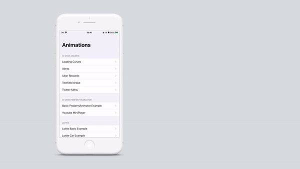

# Animations
Some Swift animations with basic examples using native API's and 3rd party libraries.



This application was based on my article at Medium and if you didn't read it yet you can check it [here](https://medium.com/@leocoout/melhorando-a-experi%C3%AAncia-do-seu-app-com-anima%C3%A7%C3%B5es-ios-5c09874b9eb5?sk=baab9addeb70bf7d0f71c8b3d6bcba54)! 


## Installation
This app use external libraries to perform some animations. To install them, use: 
```
pod install
```


## Libraries
External libraries used:
 - <b>Lottie:</b> https://github.com/airbnb/lottie-ios
 - <b>Hero:</b> https://github.com/HeroTransitions/Hero
 - <b>SkeletonView:</b> https://github.com/Juanpe/SkeletonView


### Thanks!
